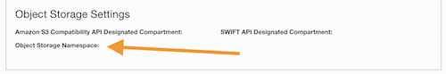

# Developer Guide

## Install prerequisites

1. Install make.
   - `$ xcode-select --install` on macOS.
   - `$ sudo apt-get install build-essential` on Ubuntu Linux
   - `$ sudo dnf install make gcc` on Oracle Linux
1. Install [Go][go]
1. Install [KIND][kind]
    - `$ GO111MODULE="on" go get sigs.k8s.io/kind@v0.12.0`.
1. Install [Kustomize][kustomize]
    - [install instructions][kustomizelinux]
1. Install [envsubst][envsubst]
   - `$ go get github.com/a8m/envsubst/cmd/envsubst`

## Fork and get the source

Fork the [`cluster-api-provider-oci repo`](https://github.com/oracle/cluster-api-provider-oci).
See the [forking](https://docs.github.com/en/get-started/quickstart/fork-a-repo) and
[cloning](https://docs.github.com/en/repositories/creating-and-managing-repositories/cloning-a-repository)
documentation for more details.

Example:
```bash
cd "$(go env GOPATH)"/src
mkdir sigs.k8s.io
cd sigs.k8s.io/
git clone git@github.com:<GITHUB USERNAME>/cluster-api-provider-oci.git
cd cluster-api-provider-oci
git remote add upstream git@github.com:orale/cluster-api-provider-oci.git
git fetch upstream
```

## Running a local management cluster for development

The simplest way to test the code is to run it on your local development workstation.
If you have `capoci-controller-manager` running in your management cluster,
please scale down the deployment, otherwise running your development build will conflict with the 
currently running `capoci-controller-manager`:

```bash
kubectl scale deployment/capoci-controller-manager  --replicas=0 -n cluster-api-provider-oci-system
```

To build, run and test all your code changes locally, copy the
`hack/auth-config-template.yaml` file to `<path-to-your-repo>/auth-config.yml` in your
cloned copy of the repository and modify it to match your local configuration.

Then run the following commands:

```bash
export AUTH_CONFIG_DIR="<path-to-your-repo>/auth-config.yaml"
make run
```

If you want to test your changes using an image built locally using `docker build`, execute the
following steps:

```bash
export TAG=<tag>
export REGISTRY="<region>.ocir.io/<namespace>"
make docker-build
```

`region` for example, `phx` or `us-phoenix-1`. See the
[Available Endpoints](https://docs.oracle.com/en-us/iaas/Content/Registry/Concepts/registryprerequisites.htm#Availab)
topic in the Oracle Cloud Infrastructure Registry (OCIR) documentation.

`namespace` is the auto-generated [object storage namespace](https://docs.oracle.com/en-us/iaas/Content/Object/Tasks/understandingnamespaces.htm)
string of the tenancy (as shown on the tenancy information page) that owns the
repository to which you want to push the image.



Push the resulting container image to the repository. For more info on how to push
to OCIR see
<https://www.oracle.com/webfolder/technetwork/tutorials/obe/oci/registry/index.html>

Execute the following steps to install the image

```bash
make release-manifests
kubectl apply -f out/infrastructure-oci/v0.1.1-development/infrastructure-components.yaml
```

[go]: https://golang.org/doc/install
[go.mod]: https://github.com/kubernetes-sigs/cluster-api-provider-aws/blob/master/go.mod
[kind]: https://sigs.k8s.io/kind
[kustomize]: https://github.com/kubernetes-sigs/kustomize
[kustomizelinux]: https://github.com/kubernetes-sigs/kustomize/blob/master/docs/INSTALL.md
[envsubst]: https://github.com/a8m/envsubst
